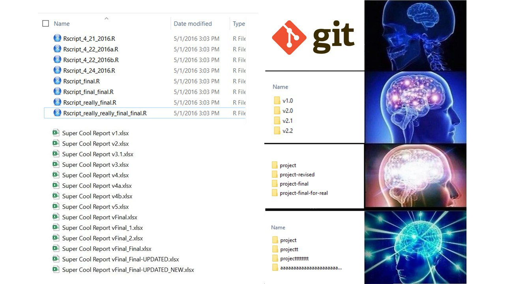
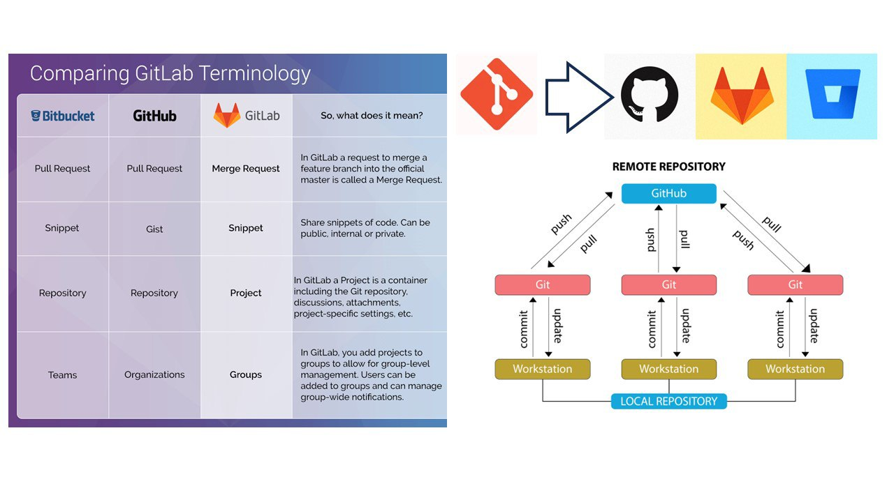
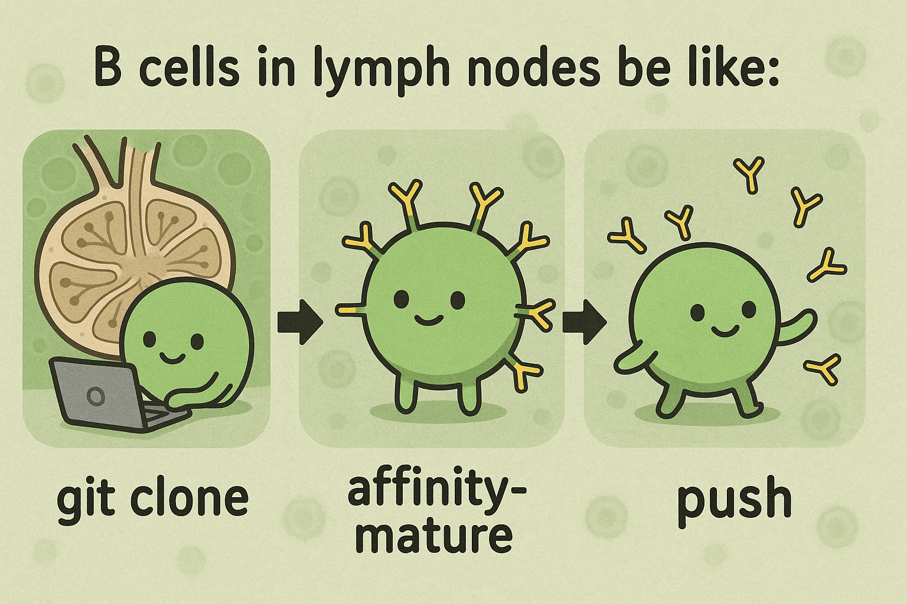

# Computer science fundamentals and resources

  - *Bioinformatics Data Skills* by Vince Buffalo


# Operating system Linux
## Linux basic resources
### Books
### Online courses

## Linux advanced resources
### Books
### Online courses

## Linux persian reources

## Linux fast tutorial


# Git and Github

## Git basic resources

### Books
- [head first git](https://i-love-git.com/)

### Online courses
- [git - the simple guide - no deep shit!](https://rogerdudler.github.io/git-guide/)
- [Git Tutorial - Medium by Jaaeehoonkim](https://medium.com/@jaaeehoonkim/git-tutorial-1-31d0b1db1940)

## Git advanced resources
### Books
- The best and most reliable: [Free book of Pro Git](https://git-scm.com/book/en/v2)  
- [Happy Git and GitHub for the useR](https://happygitwithr.com/)

### Online courses
- [Introduction to Git and GitHub](https://www.coursera.org/learn/introduction-git-github) on Coursera

## Git persian reources
- [ دوره رایگان، جذاب و خیلییی کوتاه گیت جادی تو فرادرس](https://faradars.org/courses/fvgit9609-git-github-gitlab)  
- [Milad Bahrami youtube playlist](https://www.youtube.com/playlist?list=PLhpS3tgUDZcpamFNTdjXyRKzFGaBAkcLq)  
- [Ashkan Rahmani youtube playlist](https://www.youtube.com/playlist?list=PLG-hncsy5aQ4keIG-pNoGj-zzU7TpFNPR)  
- [Git mag youtube playlist](https://www.youtube.com/playlist?list=PL1xdRbCBrpofX93iVIkyujskR4cCy261S)  
- [Salar Hagh youtube playlist](https://www.youtube.com/playlist?list=PLprvbQiR3cN9M3g22ui3MiEFkqLpVubAU)  
- [neolearn youtube video](https://www.youtube.com/watch?v=TEx_mRpIDkA)  
- [Sarvin Style Coding youtube video](https://www.youtube.com/watch?v=xDdal3QSypE)  


## Git fast tutorial
<div style="text-align: center">
{.image width="700px"}
</div>

### What is Version Control?

Imagine you're writing a research paper. You make changes, save different versions, and sometimes want to go back to previous versions. Version control is like having a time machine for your files - it helps you track changes, collaborate with others, and maintain a history of your work.

Git was made by Linus Torvalds, the same person who made Linux! It is like a super-powered save system. Instead of saving files with names like `paper_FINAL_final_UPDATED_NEW.docx` or `proj_NEW_LASTEST.R`, Git keeps track of all changes automatically.

### Basic Git Concepts & Commands

- **Repository (Repo)**: Think of it as a project folder that Git watches. Like a photo album that keeps track of all your project's versions. **Local repo** is a copy of the remote repo on your computer. **Remote repo** can be the version stored on GitHub or GitLab.

- **Commit**: Like taking a snapshot of your work. Each commit is a saved point you can return to. Like saving a checkpoint in a video game or giving your file a name/version.

<div style="text-align: center">
](./images/git/git-medium.png){.image width="600px"}
</div>

- **Branch**: Like creating a parallel universe for your work. You can experiment without affecting the main project. Like writing a draft of your paper without changing the original. Also can be used to collaborate with others, simultaneously working on the same project! You can **Merge** your changes back to the main branch after you are done. Master/Main branch is the main branch of the repo.

<div style="text-align: center">
](./images/git/git-branches-merge.png){.image width="500px"}
</div>

```bash
# Start a new project (create a new repository)
git init

# Check the status of your files
git status

# Add files to be saved (staging)
git add filename.txt    # Add specific file
git add .              # Add all files

# Save your changes (commit)
git commit -m "Description of changes"

# See your project history
git log

# Reset your branch to the latest commit
git reset --hard
```

### GitHub: Your Project's Home on the Internet



GitHub is like a social network for your code. It's where you can store your projects online, collaborate with others and share your work with the world. GitHub has **Repository Hosting** - a cloud storage specifically for code, **Issue Tracking** - a to-do list for your project and bug reporting, **Pull Requests** - suggesting changes to someone else's work or requesting changes to your own work, **Code Review** - peer review process for your code, and **CI/CD** features. 
Common workflows in GitHub: **Fork a Repository**: Like making a copy of someone else's project. You can modify it without affecting the original. **Push Changes**: Like uploading your changes to GitHub. **Clone a Repository**: Like downloading a project to your computer.

```bash
# Clone a repository
git clone https://github.com/username/repository.git

# Get updates from remote repository
git pull

# Send your changes to remote repository
git push

```

### Common Scenarios and Best Practices

When working with Git, follow these key practices: write short & clear commit messages to document changes, create feature branches for new work, keep your local copy updated regularly, and review changes before committing. For beginners, **start with basic commands and simple projects**, you can utilize visual tools like GitHub Desktop or VS Code's Git integration but I prefer to use the command line (more straightforward), learn from mistakes. Git maintains history so you can always revert!!

What usually happens daily:

1. **Starting a New Project**
   ```bash
   git init
   git add .
   git commit -m "Initial commit"
   ```
* **Note**: I prefer to initialize a new repository in GitHub with a README file and LICENSE, and then clone it to my local machine.

2. **Updating Your Work**
   ```bash
   git pull
   # Make changes
   git add .
   git commit -m "Description of changes"
   git push
   ```

3. **Working with Branches**
   ```bash
   git checkout -b new-branch-name
   # Make changes
   git add .
   git commit -m "Description of changes"
   git push
   git checkout main
   git merge new-branch-name
   ```

<div style="text-align: center">
{.image width="500px"}
</div>


# R
## Link to fast tutorial

## R basic resources

### Books

### Online courses

## R advanced resources

### Books

### Online courses

## R persian reources  
  - *R for Data Science* by Hadley Wickham
  - [R Programming](https://www.coursera.org/learn/r-programming) on Coursera  

## R fast tutorial

# Python

## Python basic resources
### Books
  - *Python for Biologists* by Martin Jones
### Online courses

## Python advanced resources
### Books
### Online courses
  - [Python for Data Science and AI](https://www.coursera.org/learn/python-for-applied-data-science-ai) on Coursera

## Python persian reources

## Python fast tutorial
