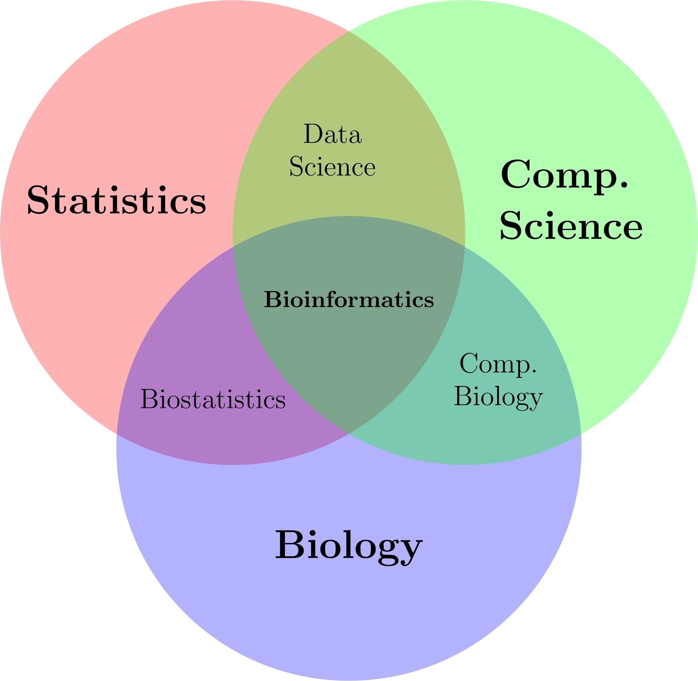

# Prerequisites {.unnumbered}

Bioinformatics is multidisciplinary, but you do not need to learn everything at once. Build a stable base first, then go deeper based on your interests and projects.

## Recommended Sequence

1. Biology fundamentals  
2. Math fundamentals  
3. Statistics fundamentals  
4. Computer science fundamentals  
5. Core bioinformatics workflow  
6. Specialized topics

## Minimum Outcomes Before Advanced Topics

| Track | Minimum outcome | Suggested time |
|---|---|---|
| Biology | Explain DNA-RNA-protein flow, central dogma, and basic experimental design | 2-3 weeks |
| Mathematics | Use matrices/vectors and basic calculus ideas in modeling/data contexts | 2-3 weeks |
| Statistics | Interpret p-values, confidence intervals, and apply simple regression/testing | 2-4 weeks |
| Computer science | Use Linux shell, Git/GitHub workflow, and basic Python/R scripting | 3-4 weeks |

## How To Use This Book

Fast path (for lab members who need results quickly)

- Study `computer_science_fundamentals.qmd` and `core-bioinformatics-workflow.qmd` first.  
- Start one small project with public data.  
- Return to biology/math/statistics chapters to strengthen weak areas.

Deep path (for undergrads building long-term foundations)

- Complete the four foundations chapters in order.  
- After each chapter, do one mini project or reproducible notebook.  
- Move to `omics-data.qmd`, then modeling/integrated platforms.

## Learning Philosophy

- Learn broad fundamentals first, then build depth in one subfield.  
- Prefer reproducible work (version control, notebooks, clear notes).  
- Keep a personal glossary and question list while studying.

